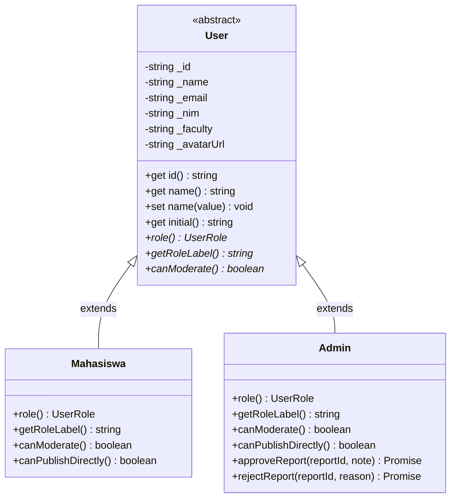
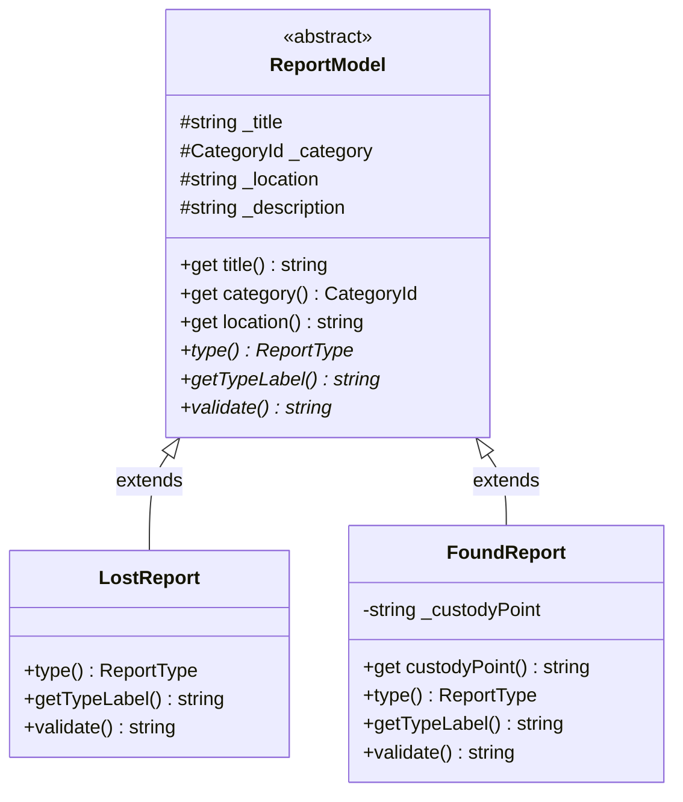
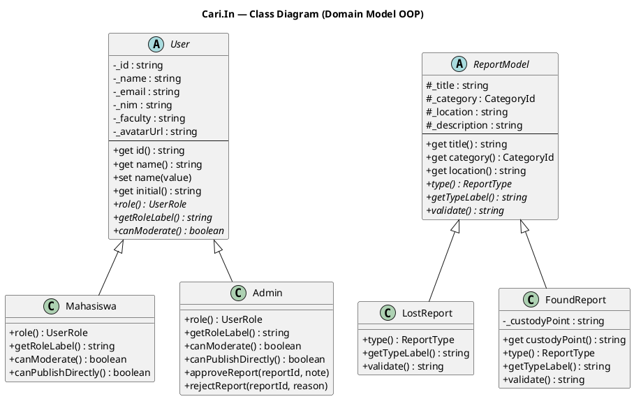

# Class Diagram — Cari.In (PBO)

> Diagram kelas model domain OOP (`src/models/`). Tersedia 2 format:
> - **Mermaid** → otomatis ter-render di GitHub / VS Code (preview).
> - **PlantUML** → paste ke [plantuml.com](https://www.plantuml.com/plantuml) atau draw.io untuk export PNG/SVG (buat slide PPT).

---

## 1. Mermaid (render langsung di GitHub)

### 1.1 Hierarki User

### 1.2 Hierarki Report

---

## 2. PlantUML (export PNG/SVG untuk PPT)

---

## 3. Keterangan Pilar OOP pada Diagram

| Simbol / Elemen | Pilar OOP |
|-----------------|-----------|
| `«abstract» User` / `ReportModel` | **Abstraction** — tidak bisa di-instansiasi langsung |
| `- _id`, `- _name` (tanda minus = private) | **Encapsulation** — field private |
| `+ get / set` | **Encapsulation** — akses terkontrol |
| Panah `<|--` (extends) | **Inheritance** — Mahasiswa/Admin ← User |
| `canModerate()`, `validate()` beda tiap subclass | **Polymorphism** — override |

> Sumber kebenaran: `src/models/User.ts`, `Mahasiswa.ts`, `Admin.ts`, `Report.ts`.
